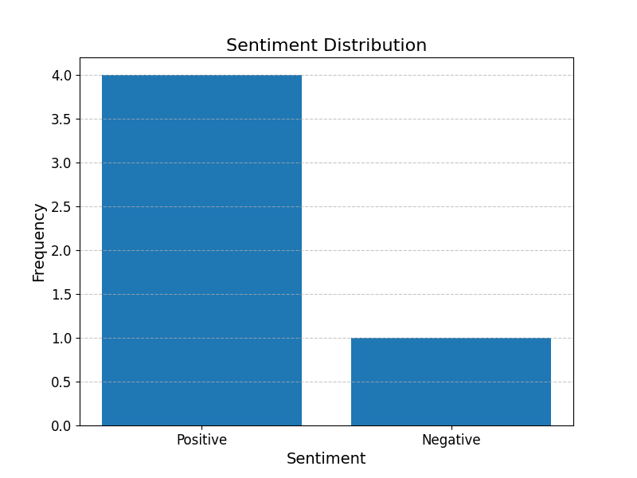

# Sentiment Analysis of Customer Feedback

## Overview
This project analyzes customer feedback to determine sentiment (Positive, Negative, or Neutral). The results are visualized in a bar chart.

## Features
- Sentiment classification using `TextBlob`
- Polarity score calculation
- Visualization of sentiment distribution

## Dataset
The dataset contains customer feedback and is located in the `data/` directory.

## Getting Started

### Prerequisites
- Python 3.8 or higher
- Install dependencies using:

### Running the Analysis
1. Clone the repository:
2. Navigate to the `notebooks/` directory and open `sentiment_analysis.ipynb` in Jupyter Notebook.
3. Run all cells to perform sentiment analysis and generate the visualization.

## Results
The sentiment distribution is visualized as follows:

## License
This project is licensed under the MIT License.
